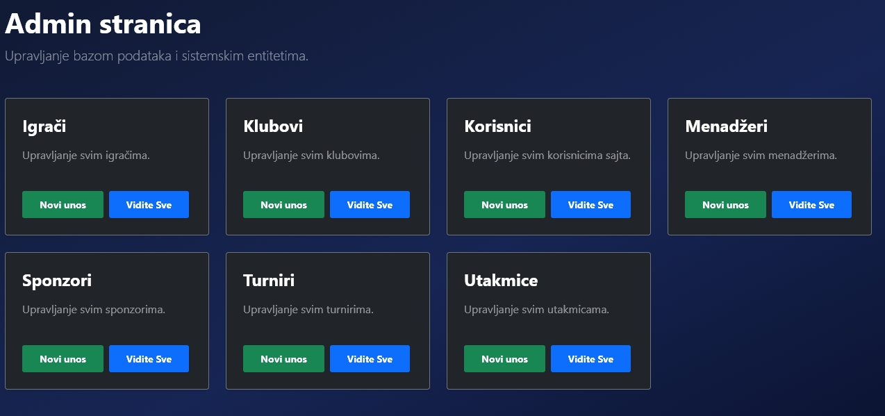

**Fudbalski Turnir** is a professional tournament management system built with **ASP.NET Core 8.0**. The application provides a comprehensive solution for managing football clubs, match results, dynamic group standings, and tournament brackets.

### Tech Stack

| Layer | Technologies |
| --- | --- |
| **Backend** | .NET 8.0 (C#) |
| **Architecture** | **MVC** with BLL and DAL layers |
| **Database** | MSSQL Server with **Entity Framework Core** |
| **Frontend** | **Razor Pages, Bootstrap 5, CSS3 Animations & HTML** |
| **Authentication** | **ASP.NET Core Identity** with custom User model & role-based authorization |
| **Version Control** | Git & GitHub |

### Key Features

* **N-Tier Architecture:** Ensures a clean separation of concerns, making the codebase highly maintainable and testable.
* **Automated Standings:** Real-time calculation of points, goal difference (GD), and ranking based on match inputs.
* **Responsive UI/UX:** Modern tournament tables featuring **CSS3 entry animations** and smooth transition effects.
* **Admin Dashboard:** Full **CRUD** capabilities for managing Players, Clubs, Users, Managers, Sponsors, Tournaments and Matches.
* **Role-Based Security (RBAC):** Custom access control ensuring only authorized personnel (Admin) can modify sensitive data.
* **Data Integrity:** Robust validation logic to prevent inconsistent match results or duplicate entries.

### Project Architecture

To ensure enterprise-grade scalability, the project is structured into three distinct layers:

1. **MVC (Model, View & Controller) :** Handles the UI logic, Razor Pages, and Controller-to-View communication.
2. **BLL (Business Logic Layer):** Has the core services (ex. `TurnirService`) and interfaces that calculate standings and enforce tournament rules.
3. **DAL (Data Access Layer):** Manages the `DbContext`, migrations, and the overall data in the web application.

### Visuals (Screenshots)

#### 1. Standings pages

#### Group Phase Standings


#### Knockout Phase Bracket


#### 2. Tournament Management

Intuitive card-based UI for browsing different seasons and active competitions.
#### Admin Page 


### Development Insights

Building this system involved a deep dive into **relational database management** and the application of **Clean Code** principles. 
Moving from a monolithic approach to an **N-Tier structure** significantly improved the modularity of the code, allowing for independent updates to the UI or business logic without affecting the data layer.

### Scalability Considerations

* **Extra stats:** Integration of **extra individual details** for players (numbers of goals scored, assists, yellow/red cards etc.)
* **Tie-Breaker Logic:** Advanced **Head-to-Head (H2H)** calculation for complex group scenarios.
* **Internationalization (i18n):** Full localization support for **Serbian** (Cyrillic/Latin) and **English**.
* **Two-Leg Knockout System:** Support for **home/away** aggregate scoring in the knockout phases.

### Getting Started

1. **Clone the repository:**
```bash
git clone https://github.com/DusanSl/Fudbalski-Turnir-ASP.NET

```

2. **Configure the Database:**
Update the connection string in `appsettings.json`, then run the following in the Package Manager Console:
```powershell
Update-Database

```

3. **Run the App:**
Press **F5** in Visual Studio or use the CLI:
```bash
dotnet run

```

### Demo (Admin Access)
After setting up the database, you can use these credentials to access the administrative features:

| Role | Email | Password |
| :--- | :--- | :--- |
| **Administrator** | `admin@football.com` | `Admin123!` |

## License

[](http://creativecommons.org/licenses/by-nc-sa/4.0/)

This work is licensed under a [Creative Commons Attribution-NonCommercial-ShareAlike 4.0 International License](http://creativecommons.org/licenses/by-nc-sa/4.0/).

Full license: [LICENSE](LICENSE.txt) | [CC BY-NC-SA 4.0](https://creativecommons.org/licenses/by-nc-sa/4.0/)

**What this means:**

- **Share** — You can view and fork this repository
- **Adapt** — You can modify the code for educational purposes
- **Attribution** — You must give appropriate credit and link to this repository
- **NonCommercial** — You may not use this work for commercial purposes without permission
- **ShareAlike** — Modified versions must use the same license

**Copyright © 2026 Dušan Slankamenac**

For commercial licensing inquiries: [dusanslankamenac8@gmail.com]
